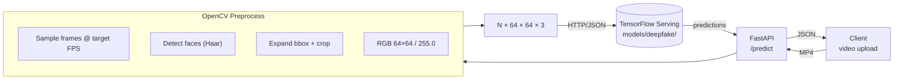
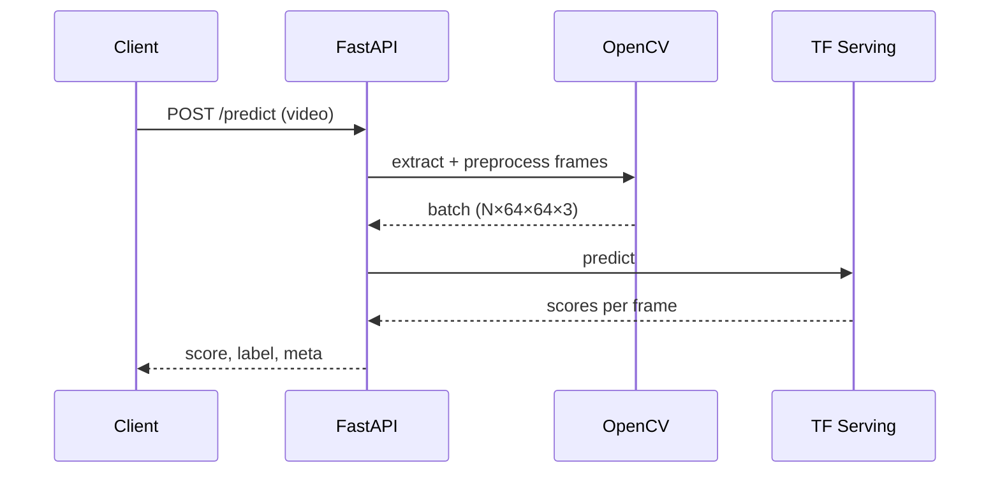

## Deepfake Detector (DFD)

[](https://www.python.org/)
[](https://fastapi.tiangolo.com/)
[](https://opencv.org/)
[](https://www.tensorflow.org/tfx/guide/serving)
[](https://www.docker.com/)
[](https://python-poetry.org/)

An end‑to‑end, containerized deepfake detection system. It pairs a face‑centric video preprocessor (OpenCV + Haar cascade) with a TensorFlow Serving model endpoint and exposes a clean FastAPI for real‑time predictions.

- **Input**: a video file (e.g., MP4)
- **Processing**: sample frames at target FPS, detect and crop faces, normalize to 64×64 RGB
- **Model**: EfficientNet‑B0 based classifier (trained with oversampling; see notebooks)
- **Output**: overall deepfake score and label, plus per‑frame scores and metadata

Explore the interactive docs at `http://localhost:8000/docs` once the stack is up.

### Why this repo?
- **Practical pipeline**: from raw video to face patches ready for inference
- **Production‑friendly**: decoupled API and model via TF Serving, versioned models in `models/deepfake/{version}`
- **Simple deploy**: `docker compose up` and you’re testing deepfakes in minutes

## Architecture



## Repository Map
- `api/app/main.py`: FastAPI with `/health` and `/predict`
- `api/app/inference.py`: frame extraction, face detection, TF Serving client, aggregation
- `settings.py`: all tunables via environment variables
- `docker-compose.yml`: two services — `tfserving` and `api`
- `models/deepfake/1/`: SavedModel for TF Serving; add new versions as `2/`, `3/`, ...
- `EfficientB0_OVERSAMPLING.ipynb`: training + oversampling pipeline
- `EB0_OVS_PREDICTIONS.ipynb`: evaluation/predictions exploration

## Quickstart

### Option A — Docker (recommended)
1) Place a TensorFlow SavedModel under `models/deepfake/1/` (already present here).
2) Start the stack:

```bash
docker compose up -d
```

3) Open `http://localhost:8000/docs` for Swagger UI.

4) Predict with a sample video:

```bash
curl -X POST "http://localhost:8000/predict" \
  -F "file=@/path/to/video.mp4" \
  -H "Authorization: Bearer change-me"
```

PowerShell (Windows):

```powershell
curl -Method POST "http://localhost:8000/predict" `
  -Headers @{ Authorization = "Bearer change-me" } `
  -Form @{ file = Get-Item "/path/to/video.mp4" }
```

### Option B — Local dev (Poetry)
```bash
cd api
poetry install
poetry run uvicorn app.main:app --reload --host 0.0.0.0 --port 8000
```

You still need a model server. Either run TF Serving via Docker:

```bash
docker run --rm -p 8501:8501 \
  -e MODEL_NAME=deepfake \
  -v ${PWD}/models/deepfake:/models/deepfake:ro \
  tensorflow/serving:2.14.1
```

Or set `TF_SERVING_URL` to point to an existing instance.

## API

### Health
```http
GET /health
```
Returns TF Serving status and metadata.

### Predict
```http
POST /predict
Content-Type: multipart/form-data
Form field: file=<video.mp4>
Query (optional): fps=<float>
```

Response example:

```json
{
  "score": 0.71,
  "label": "fake",
  "frame_samples": [
    { "t": 0.12, "score": 0.65 },
    { "t": 0.62, "score": 0.74 }
  ],
  "version": "1",
  "latency_ms": 324,
  "meta": {
    "src_fps": 29.97,
    "total_frames": 1860,
    "used_step": 15,
    "face_frames": 128,
    "face_detect_rate": 0.92
  }
}
```

## Configuration

The service is fully configurable via environment variables (see `settings.py`).

| Name | Default | Description |
|---|---:|---|
| `MODEL_NAME` | `deepfake` | TF Serving model name |
| `MODEL_VERSION` | `1` | Exposed in responses; for your tracking |
| `TF_SERVING_URL` | `http://tfserving:8501` | TF Serving base URL |
| `DEFAULT_FPS` | `2.0` | Target FPS for frame sampling |
| `MAX_FRAMES` | `256` | Max frames per request |
| `THRESHOLD` | `0.5` | Score threshold: ≥ fake, < real |
| `REQUEST_TIMEOUT` | `30.0` | Seconds for TF Serving HTTP calls |
| `REQUIRE_AUTH` | `false` | Gate `/predict` behind a bearer token |
| `JWT_SECRET` | `change-me` | Static token checked when auth is enabled |

Create a `.env` at repo root to override:

```env
TF_SERVING_URL=http://localhost:8501
THRESHOLD=0.6
REQUIRE_AUTH=true
JWT_SECRET=super-secret-token
```

## Training Notebooks (high‑level)

- `EfficientB0_OVERSAMPLING.ipynb`: EfficientNet‑B0 classifier trained with class oversampling to handle dataset imbalance. Includes data preparation, augmentations, model definition, training loop, and checkpoints export to SavedModel.
- `EB0_OVS_PREDICTIONS.ipynb`: Sanity‑checks model outputs on held‑out clips, shows per‑frame scores and aggregate video‑level decision. Useful for choosing a decision `THRESHOLD`.

Tip: export the final model to `models/deepfake/<version>/` as a TensorFlow SavedModel for TF Serving.

## Implementation Notes

- **Face detection**: OpenCV Haar cascade; we pick the largest face and expand the bbox with a margin for robustness.
- **Fallback**: if no faces are found, we sample uniformly spaced square crops to maintain coverage.
- **Normalization**: 64×64 RGB, `float32`, scaled to `[0, 1]`.
- **Aggregation**: mean of per‑frame scores; configurable `THRESHOLD` determines `real` vs `fake`.



## Development

- Code style: ruff + mypy + pytest configured in `api/pyproject.toml`
- Run tests (if/when added): `poetry run pytest`
- Lint: `poetry run ruff check .`  Type‑check: `poetry run mypy .`

## Deploying

- Update model by adding a new version directory, e.g., `models/deepfake/2/`.
- Bump `MODEL_VERSION` env to reflect what you’re serving.
- Recreate the `tfserving` container or restart the compose stack.

## Security

- For private deployments, set `REQUIRE_AUTH=true` and pass `Authorization: Bearer <JWT_SECRET>` with requests.
- Consider placing the API behind a reverse proxy (see `nginx/`) with TLS.

## Troubleshooting

- 400 “Failed to open video”: ensure the upload is a valid video (MP4/MOV) and the request is `multipart/form-data`.
- 5xx from TF Serving: verify the `models/deepfake/<ver>/` mount and `TF_SERVING_URL`.
- No faces detected: try increasing `DEFAULT_FPS` or ensure faces are visible; fallback sampling will kick in.

## Credits

Built by GAUTAM JHALARIA. Made with FastAPI, OpenCV, and TensorFlow Serving.
