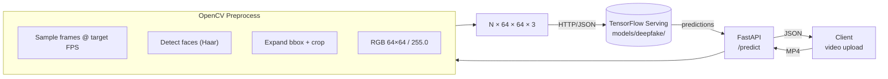
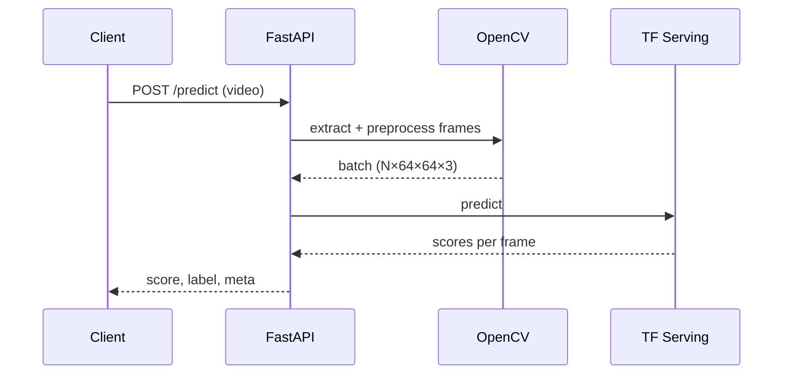

## Deepfake Detection System (DFD) - Enhanced Edition

[](https://www.python.org/)
[](https://fastapi.tiangolo.com/)
[](https://reactjs.org/)
[](https://www.typescriptlang.org/)
[](https://mui.com/)
[](https://opencv.org/)
[](https://www.tensorflow.org/tfx/guide/serving)
[](https://www.docker.com/)
[](https://python-poetry.org/)

A **production-ready, full-stack deepfake detection system** with advanced web dashboard, real-time analytics, and comprehensive video analysis capabilities.

### 🚀 **New Features**
- **Interactive Web Dashboard** - React/TypeScript frontend with Material-UI
- **Real-time Processing Progress** - Live updates during analysis
- **Frame-by-Frame Analysis** - Interactive confidence score visualization with heatmaps
- **Batch Processing** - Analyze multiple files simultaneously
- **URL Analysis** - Direct analysis from YouTube, social media, and video URLs
- **Advanced Analytics** - Historical analysis, trends, and performance metrics
- **Multi-format Support** - Videos (MP4, AVI, MKV, WebM) and Images (JPG, PNG, etc.)
- **Export Capabilities** - CSV export for analysis results
- **Enhanced API** - RESTful endpoints with comprehensive response data

### 🎯 **Core Capabilities**
- **Input**: Videos, images, or URLs from popular platforms
- **Processing**: Advanced frame sampling, face detection, and preprocessing
- **Model**: EfficientNet‑B0 classifier with confidence scoring
- **Output**: Detailed analysis with frame-level insights and metadata

Access the web dashboard at `http://localhost:3000` and API docs at `http://localhost:8000/docs`

### Why this repo?
- **Practical pipeline**: from raw video to face patches ready for inference
- **Production‑friendly**: decoupled API and model via TF Serving, versioned models in `models/deepfake/{version}`
- **Simple deploy**: `docker compose up` and you’re testing deepfakes in minutes

## Architecture


```mermaid
flowchart LR
  U["Client<br/>video upload"] -- MP4 --> API["FastAPI<br/>/predict"]
  subgraph Preprocess [OpenCV Preprocess]
    F1["Sample frames @ target FPS"]
    F2["Detect faces (Haar)"]
    F3["Expand bbox + crop"]
    F4["RGB 64×64 / 255.0"]
  end
  API --> Preprocess --> BATCH["N × 64 × 64 × 3"]
  BATCH -- HTTP/JSON --> TFS[("TensorFlow Serving<br/>models/deepfake/<ver>")]
  TFS -- predictions --> API
  API -- JSON --> U
```

## Repository Map
- `api/app/main.py`: FastAPI with `/health` and `/predict`
- `api/app/inference.py`: frame extraction, face detection, TF Serving client, aggregation
- `settings.py`: all tunables via environment variables
- `docker-compose.yml`: two services — `tfserving` and `api`
- `models/deepfake/1/`: SavedModel for TF Serving; add new versions as `2/`, `3/`, ...
- `EfficientB0_OVERSAMPLING.ipynb`: training + oversampling pipeline
- `EB0_OVS_PREDICTIONS.ipynb`: evaluation/predictions exploration

## 🚀 Quick Start

### Option A — Full Stack (Recommended)
Launch the complete system with web dashboard:

```bash
# Start all services (API, TensorFlow Serving, Frontend)
docker compose up -d

# Access the web dashboard
open http://localhost:3000

# Access API documentation
open http://localhost:8000/docs
```

### Option B — Development Mode
For development with hot-reload:

```bash
# Start development environment
docker compose -f docker-compose.dev.yml up -d

# Frontend will be available at http://localhost:3000
# API will be available at http://localhost:8000
```

### Option C — API Only
If you only need the API:

```bash
# Start just the backend services
docker compose up -d tfserving api

# Test with curl
curl -X POST "http://localhost:8000/predict" \
  -F "file=@/path/to/video.mp4" \
  -H "Authorization: Bearer change-me"
```

### Option D — Local Development
```bash
# Backend
cd api
poetry install
poetry run uvicorn app.main:app --reload --host 0.0.0.0 --port 8000

# Frontend (in another terminal)
cd frontend
npm install
npm start
```

## 🌐 Web Dashboard Features

### 📊 **Interactive Analytics Dashboard**
- Real-time processing statistics and trends
- Daily analysis metrics with charts
- System health monitoring
- High-confidence detection alerts

### 🎬 **Advanced Video Analysis**
- **Single File Analysis**: Drag-and-drop interface with real-time progress
- **Batch Processing**: Analyze multiple files simultaneously
- **URL Analysis**: Direct analysis from YouTube, Vimeo, social media
- **Frame-by-Frame Viewer**: Interactive timeline with confidence scores
- **Confidence Heatmaps**: Visual representation of suspicious regions

### 📈 **Visualization Components**
- **Confidence Timeline**: Score trends over video duration
- **Frame Analysis**: Individual frame confidence with navigation
- **Distribution Charts**: Real vs fake classification breakdown
- **Performance Metrics**: Processing speed and quality indicators

### 📋 **Analysis History**
- Searchable and filterable analysis records
- Detailed result viewing with metadata
- CSV export functionality
- Historical trend analysis

## 🔧 Enhanced API Endpoints

### Core Analysis
```http
POST /predict              # Single video/image analysis
POST /predict-image        # Dedicated image analysis
POST /predict-batch        # Multiple file processing
POST /predict-url          # URL-based analysis
```

### Analytics & History
```http
GET /history              # Analysis history with pagination
GET /analysis/{id}        # Detailed analysis results
GET /stats                # Processing statistics and trends
GET /status/{id}          # Real-time processing status
```

### System
```http
GET /health               # System health check
GET /supported-formats    # Supported file formats
```

### Enhanced Response Format
```json
{
  "id": "uuid-analysis-id",
  "score": 0.71,
  "label": "fake",
  "frame_samples": [...],
  "confidence_trend": [...],
  "processing_stats": {
    "frames_processed": 128,
    "avg_confidence": 0.68,
    "processing_fps": 15.2
  },
  "face_quality_metrics": {
    "face_detection_rate": 0.92,
    "face_consistency": 0.85
  },
  "version": "1",
  "latency_ms": 324
}
```

## Configuration

The service is fully configurable via environment variables (see `settings.py`).

| Name | Default | Description |
|---|---:|---|
| `MODEL_NAME` | `deepfake` | TF Serving model name |
| `MODEL_VERSION` | `1` | Exposed in responses; for your tracking |
| `TF_SERVING_URL` | `http://tfserving:8501` | TF Serving base URL |
| `DEFAULT_FPS` | `2.0` | Target FPS for frame sampling |
| `MAX_FRAMES` | `256` | Max frames per request |
| `THRESHOLD` | `0.5` | Score threshold: ≥ fake, < real |
| `REQUEST_TIMEOUT` | `30.0` | Seconds for TF Serving HTTP calls |
| `REQUIRE_AUTH` | `false` | Gate `/predict` behind a bearer token |
| `JWT_SECRET` | `change-me` | Static token checked when auth is enabled |

Create a `.env` at repo root to override:

```env
TF_SERVING_URL=http://localhost:8501
THRESHOLD=0.6
REQUIRE_AUTH=true
JWT_SECRET=super-secret-token
```

## Training Notebooks (high‑level)

- `EfficientB0_OVERSAMPLING.ipynb`: EfficientNet‑B0 classifier trained with class oversampling to handle dataset imbalance. Includes data preparation, augmentations, model definition, training loop, and checkpoints export to SavedModel.
- `EB0_OVS_PREDICTIONS.ipynb`: Sanity‑checks model outputs on held‑out clips, shows per‑frame scores and aggregate video‑level decision. Useful for choosing a decision `THRESHOLD`.

Tip: export the final model to `models/deepfake/<version>/` as a TensorFlow SavedModel for TF Serving.

## Implementation Notes

- **Face detection**: OpenCV Haar cascade; we pick the largest face and expand the bbox with a margin for robustness.
- **Fallback**: if no faces are found, we sample uniformly spaced square crops to maintain coverage.
- **Normalization**: 64×64 RGB, `float32`, scaled to `[0, 1]`.
- **Aggregation**: mean of per‑frame scores; configurable `THRESHOLD` determines `real` vs `fake`.


```mermaid
sequenceDiagram
  participant C as Client
  participant A as FastAPI
  participant V as OpenCV
  participant S as TF Serving
  C->>A: POST /predict (video)
  A->>V: extract + preprocess frames
  V-->>A: batch (N×64×64×3)
  A->>S: predict
  S-->>A: scores per frame
  A-->>C: score, label, meta
```

## Development

- Code style: ruff + mypy + pytest configured in `api/pyproject.toml`
- Run tests (if/when added): `poetry run pytest`
- Lint: `poetry run ruff check .`  Type‑check: `poetry run mypy .`

## Deploying

- Update model by adding a new version directory, e.g., `models/deepfake/2/`.
- Bump `MODEL_VERSION` env to reflect what you’re serving.
- Recreate the `tfserving` container or restart the compose stack.

## Security

- For private deployments, set `REQUIRE_AUTH=true` and pass `Authorization: Bearer <JWT_SECRET>` with requests.
- Consider placing the API behind a reverse proxy (see `nginx/`) with TLS.

## Troubleshooting

- 400 “Failed to open video”: ensure the upload is a valid video (MP4/MOV) and the request is `multipart/form-data`.
- 5xx from TF Serving: verify the `models/deepfake/<ver>/` mount and `TF_SERVING_URL`.
- No faces detected: try increasing `DEFAULT_FPS` or ensure faces are visible; fallback sampling will kick in.

## Credits

Built by GAUTAM JHALARIA. Made with FastAPI, OpenCV, and TensorFlow Serving.
